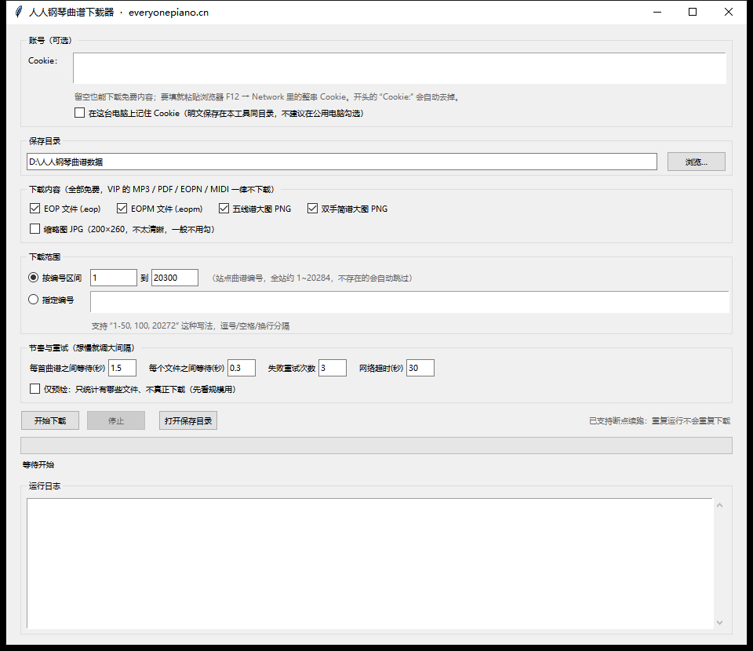

# 人人钢琴网 · 免费曲谱下载器

把 [人人钢琴网](https://www.everyonepiano.cn/Music.html)（everyonepiano.cn）上**不需要 VIP** 的曲谱成批下载到本地硬盘。
图形面板：自己填 Cookie、自己选下载目录、自己定请求节奏。**只依赖 Python 标准库**，不需要 `pip install` 任何东西。

**▶ 使用说明（网页版）：<https://chenzhuanxin.github.io/everyonepiano-sheet-downloader/>**

## 下载

到 [Releases](https://github.com/chenzhuanxin/everyonepiano-sheet-downloader/releases/latest) 取 `PianoSheetDownloader.exe`。
Windows 10 / 11 64 位，单文件免安装，双击即用。

## 只下这四种（免 VIP）

| 会下载 | 规格 | 不会下载（需 VIP） |
| --- | --- | --- |
| 五线谱大图 PNG | 2500×3400，每页一张，约 100–150 KB | MP3 |
| 双手简谱大图 PNG | 2381×3368，每页一张，约 60–260 KB | PDF |
| EOP 文件 | `.eop`，EOP 软件可直接播放 | EOPN |
| EOPM 文件 | `.eopm`，配合 EOP 使用的指法／教程包 | MIDI |

需要 VIP 的那四类，在曲谱页上只有「购买 VIP 会员」的入口，没有下载链接。
本工具不去猜地址、不去试接口、不做任何绕过付费内容的尝试。

面板里另有一个可选的「缩略图 JPG」（200×260，默认不勾）：它只是列表页那种小图，
真正能拿去弹的是上面的**大图 PNG**。

## 功能

- **真实大图曲谱**：五线谱 2500×3400、双手简谱 2381×3368，都是免费资源；每首的图片张数从曲谱页上的「共 N 张」读取
- **断点续跑**：不写任何标记文件。重新运行时会检查文件是否已存在、大小是否为零、文件头魔数是否正确，通过就跳过
- **逐字节校验**：EOP（`4 04`）、EOPM（`EveryonePiano`）、PNG（`‰PNG`）、JPG（`ÿØ`）四种魔数分别核对，错的一律不算数
- **节奏可调**：每首之间、每个文件之间的等待都能改；失败重试次数与网络超时也能改。想更慢、更礼貌地抓，把间隔调大即可
- **失败保护**：连续 8 次网络失败自动停下，不硬闯
- **仅预检**：只统计有哪些文件、不真正下载，先看规模再决定
- **台账留痕**：`曲谱清单.csv`（每首一行）、`下载日志.txt`（每个文件的判定与失败原因）
- **设置持久化**：面板选项存在工具同目录的 `下载器设置.json`；Cookie 只有勾了「记住 Cookie」才会写进去

## 从源码运行

只用到标准库，**不需要 `pip install`**：

```bash
python 人人钢琴曲谱下载器.py
```

需要 Python 3.9+（自带 tkinter 与 urllib）。行为与 exe 完全一致。

## 界面



原型界面里的 Cookie 输入框默认是空的——那一格就是留给你自己填的。

## 输出结构

```
D:\人人钢琴曲谱数据\
├─ 0020272-滨河东路-赵磊-焉栩嘉-张颜齐-贺俊雄-赵政豪-蒋熠铭\
│   0020272.eop                     ← 曲子本体
│   0020272.eopm                    ← 指法／教程包
│   0020272-w-b-1.png … -w-b-5.png  ← 五线谱大图，2500×3400，共 5 页
│   0020272-j-b-1.png … -j-b-4.png  ← 双手简谱大图，2381×3368，共 4 页
├─ 0001674-生日快乐完整好听版\
│   0001674.eop                     ← 这首站点本身没有 EOPM，就不会有那个文件
│   0001674-w-b-1.png  0001674-j-b-1.png …（每首的张数由曲谱本身长度决定）
├─ 曲谱清单.csv                      ← 每首一行的台账：已获得哪些、状态、备注
└─ 下载日志.txt                      ← 每个文件的判定结果与失败原因
```

文件夹名是「7 位补齐编号-曲名」，文件夹里的文件名则是纯编号 + 后缀。
不存在的编号不会建空文件夹——站点对不存在的资源返回的是一张 1382 字节的伪页面，工具按内容判定，日志里写明「编号不存在」。

## 免责声明

仅用于个人学习与收藏。请遵守网站服务条款，把请求间隔放得宽一些，不要高频请求。
本工具与人人钢琴网没有从属关系，也未获得其授权或认可；曲谱版权归原权利人所有。
